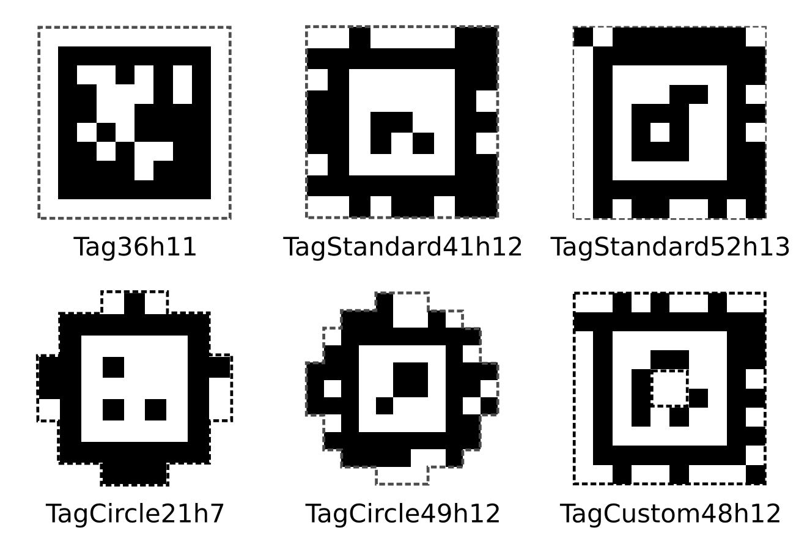

# Computing TF Transforms with AprilTag

Suppose we have designed a mount for a camera to be placed on the robot. We
likely need to obtain the transform between the camera and the robot, so images
obtained from the camera can be transformed into information the robot can act
upon. One method is to use the mount design, to compute the translation and
rotation of the camera. However, 3D printing is often imperfect, and can result
in inaccurate calibration. What's a simple, empirical method of obtaining a
transform?

One way is to use AprilTag, a visual fiducial system that can be used for a
multitude of tasks including AR and camera caliberation. These tags resemble QR
codes, and their visually distinctive features and small payload allow for
accurate and fast localization.



We print one of these fiducials of size 8cm, in this case the `TagStandard41h12` tag with ID
494, and place it at a known location. Here, we know it is at a x-displacement
of 0.143m from the robot base link. We adjust the camera such that the camera is
able to see the fiducial.


First, we publish the known transform:

```
rosrun tf static_transform_publisher -0.140 0 0 at494 world 1000
```

Then, we clone and configure [apriltag_ros](https://github.com/AprilRobotics/apriltag_ros/), changing the settings for our fiducial. We set `tag_family` in `settings.yml` to our `tagStandard41h12`, and setup the fiducial in `tags.yml`:

```
standalone_tags:
[
  { id:494, size: 0.08, name: "at494" }
]
```

Start the camera stream:

```
roslaunch realsense2_camera rs_camera.launch
```

and start the AprilTag continuous detection node, making it read images from the camera stream, and publish the transforms:

```
roslaunch apriltag_ros continuous_detection.launch publish_tfs:=true camera_frame:=camera_color_optical_frame camera_name:=/camera/color image_topic:=image_raw
```

We should see that AprilTag is able to detect our fiducial, and that the transforms are being published.


Now that we know the transform between the camera and the fiducial, and there is a known transform between the fiducial and the robot, we can now compute the transform between the camera and some fixed link (e.g. the base link of the gripper we are using):

```
rosrun tf tf_echo camera_link robotiq_arg2f_base_link
```

We should see something like:

```
At time 1603444940.190
- Translation: [-0.069, -0.015, 0.057]
- Rotation: in Quaternion [0.712, -0.004, 0.702, -0.010]
            in RPY (radian) [-2.163, -1.548, -0.970]
            in RPY (degree) [-123.957, -88.668, -55.549]
```

We can now use this transform via a `static_transform_publisher` for our robotic tasks. These computed transforms should be double checked against its theoretical values for accuracy. 
