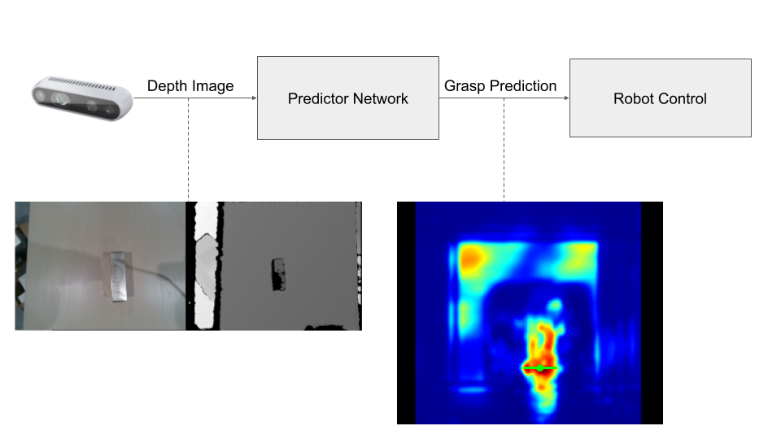

# Grasping Pipeline

This is a simple grasping pipeline implemented on the Franka Emika Panda robot.
Currently, two grippers are supported: the Franka gripper and the Robotiq 2F
gripper series.

Depth images are obtained via an Intel Realsense camera, and passed to a neural
network to obtain the appropriate grasp point. The robot controller then plans a
trajectory towards the target pose to grasp the object.

This pipeline depends on many parts of this mono-repo:

1. `algorithms/ggrasp` for the predictor network
2. `robots/franka_ros`, `robots/libfranka` for Franka-related library support
3. Our modified `robots/panda_moveit_config`
4. `robots/robotiq` for support for the robotiq gripper
5. Our `robots/franka_robotiq_description` for visualizing the Franka with the Robotiq gripper
6. Our `robots/franka_control_wrappers` for high-level controller programming

For more information on the predictor network and how to train it, see the
[ggrasp README](../../algorithms/ggrasp/README.md).

# Robot Controllers

In this repository, we provide 3 simple controllers. These controllers are able
to utilize the output of the grasp predictor network in real-time.

The following commands are for running the system with the Franka gripper.

## Open-loop

    roslaunch mvp_grasping wrist_realsense.launch # Setup realsense camera
    roslaunch ggrasp ggrasp_rt.launch             # Start real-time prediction
    roslaunch mvp_grasping robot_bringup.launch   # Start robot controller
    rosrun mvp_grasping panda_open_loop_grasp.py  # Run open-loop scenario

1.  `ggrasp_rt` continuously receives depth images from the intel realsense, and
    produces target grasp poses at `/ggrasp/predict`
2.  A single target grasp pose is read, and the target grasp pose is computed
3.  The robot moves to a pregrasp pose `0.05m` above the target pose, and
    performs a descent using velocity control to grasp the object
4.  The robot then returns to its initial position and releases the gripper

## Closed-loop

    roslaunch mvp_grasping wrist_realsense.launch # Setup realsense camera
    roslaunch ggrasp ggrasp_rt.launch             # Start real-time prediction
    roslaunch mvp_grasping robot_bringup.launch   # Start robot controller
    rosrun mvp_grasping panda_closed_loop_grasp.py  # Run closed-loop scenario

1.  `ggrasp_rt` continuously receives depth images from the intel realsense, and
    produces target grasp poses (at `/ggrasp/predict`). Some additional machinery
    is in place to ensure that the target grasp pose does not jump too wildly.
2.  Target grasp poses are continuously read from the `/ggrasp/predict` stream.
3.  While the distance of the robot&rsquo;s current pose is > `max_dist_to_target`, the
    robot uses velocity control, with velocity vector \(\lambda \times
       (T_{target} - T_{current})\).

# Running with the Robotiq gripper

Replace the commands:

    roslaunch mvp_grasping robot_bringup.launch

with:

    roslaunch mvp_grasping robot_bringup.launch gripper:=robotiq comport:=/dev/ttyUSB1

and the `rosrun` commands e.g.:

    rosrun mvp_grasping panda_closed_loop_grasp.py

with:

    rosrun mvp_grasping panda_closed_loop_grasp.py _gripper:=robotiq

## Data Collection

    roslaunch mvp_grasping wrist_realsense.launch # Setup realsense camera
    roslaunch ggrasp ggrasp_rt.launch             # Start real-time prediction
    roslaunch mvp_grasping robot_bringup.launch   # Start robot controller
    rosrun mvp_grasping panda_collect.py          # Run data collection

The idea is to collect data on previously unseen objects, bootstrapping using a
network trained on a public dataset.

A target pose is obtained via the network, and executed using the open-loop
control scenario. If the grasp is a success, the depth image is saved, along
with the grasp bounding box given by the predicted target pose. The data is
saved in a format similar to the Jacquard dataset, and can be used for
fine-tuning the model on relevant objects.

# Notes

## Depth Image Filtering

The Intel Realsense node contains multiple filters for post-processing of the
depth image. By default, the temporal filter is turned on. This filter produces
**poor** results for the closed-loop grasping scenario, as the post-processed
depth image using a temporal filter with a moving camera is poor. Ensure that
the temporal filter is turned off. We have turned it off in our
`wrist_realsense.launch` file.

## Disabling the Octomap

To prevent moveit from erroring, claiming that the end-effector is in contact
with the object it has grasped, we need to clear or disable the octomap. This is
particularly problematic with the Robotiq gripper: the mount we designed has the
gripper in vision, which causes the octomap to populate incorrectly when the robot
moves.

We have disabled the octomap in our version of `robots/panda_moveit_config`.
This unfortunately means that the robot does not use sensor information during
planning.

TODO: Manually add the table/bin into the scene as collision objects 

## Correcting grasp positions for different grippers

The MoveIt uses `panda_link8` as the end-effector link. This link is rotated at
a 45 degrees relative to the camera on the z-axis. Hence, when planning a grasp, it is necessary to first correct the grasp pose (see [MoveIt's Pick & Place Tutorial](https://ros-planning.github.io/moveit_tutorials/doc/pick_place/pick_place_tutorial.html#setting-grasp-pose)). This is where our `correct_grasp` function comes in. 

Somehow computing the TF transform between `panda_EE` and `panda_link8`, and
using the translation and rotation from there results in the planner failing
with "No motion plan found", despite the target pose being the same. See commit
hash 031c6c3.
